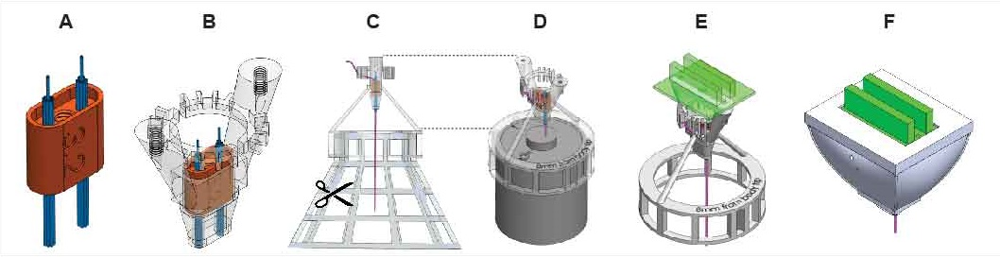
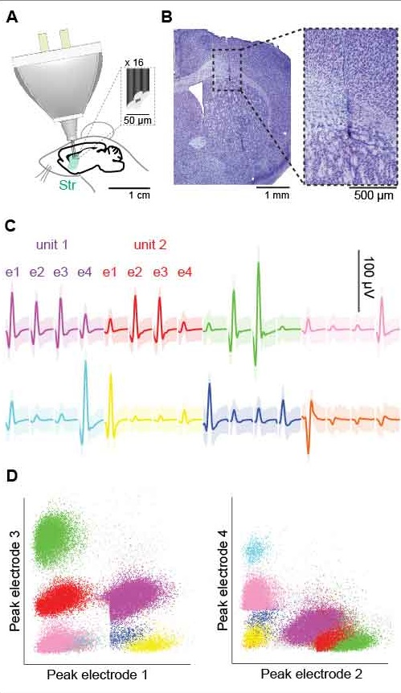
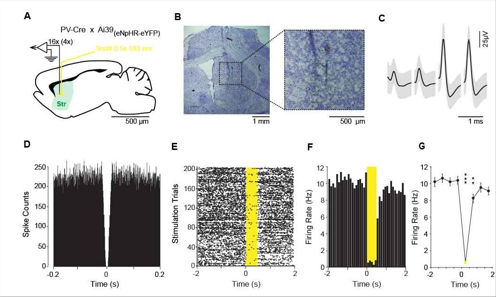
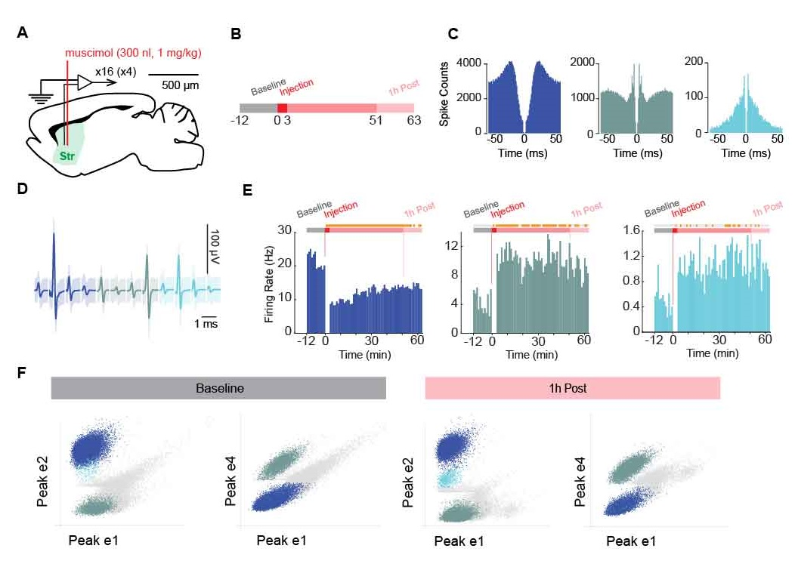

# Welcome to the HOPE project GitHub Page

Here we present and share the full design of a new generation of neural implant.
- easy to build
- 3D printable
- versatile


## **FIGURE 1** | Schematic representation of the HOPE implant
(A) Dimensions, weight and cost.
(B) Section view showing the drive mechanism used to move the shuttle.
(C) Exploded view of the implant.



## **FIGURE 2** | Construction Steps of HOPE-implant
(A) Insertion of the two bundles into the shuttle.
(B) Insertion of the shuttle into the body
(C) Insertion and cut of the tetrodes 
(D) Leveling of tetrode lengths 
(E) Addition of the drive system (screw and bar)
(F) Encapsulation of the implant



## **FIGURE 3** | Chronic recordings in the dorsal striatum
(A) Schematic representation of the recording preparation, including the tip of a tetrode.
(B) Histological results showing the position of the tetrode tip in the striatum.
Representations of 8 isolated single units recorded by 4 electrodes (e) on a same tetrode.
(C) Waveforms of each single unit recorded on the fourth electrodes of the tetrode
(D) Representation of all the waveforms based on the magnitude of their peak on each electrode.



## **FIGURE 4** | Optogenetic inhibition of PV cells in the striatum
(A) Schematic representation of the recording location.
(B) Histological confirmation showing the position of the recording electrodes [arrows].
(C) Averaged waveform of one isolated single unit on the four electrodes of one tetrode
(D) Autocorrelogram of the unit showed in (C) confirming there is no spikes during the firing refractory period.
(E) Raster plot of the unit showed in (C).
(F) Peri-stimulus time histogram showing reduction of the firing rate during illumination.



## **FIGURE 5** | Muscimol injeciton in the striatum
(A) Schematic representation of the recording and injection location.
(B) Experimental design.
(C) Averaged waveform of an isolated single unit from one tetrode.
(D) Autocorrelogram of the single units isolated and shown in (C).
(E) Firing rate histogram showing the time course of the firing rate before and after muscimol injection (t=0). On top of the experimental design the orange rectangles represent the period when the signal is different from the baseline period (th = 3*std). 
(F) Peri-stimulus time histogram showing reduction of the firing rate during illumination.


## Welcome to GitHub Pages

You can use the [editor on GitHub](https://github.com/delcasso/hope/edit/master/README.md) to maintain and preview the content for your website in Markdown files.

Whenever you commit to this repository, GitHub Pages will run [Jekyll](https://jekyllrb.com/) to rebuild the pages in your site, from the content in your Markdown files.

### Markdown

Markdown is a lightweight and easy-to-use syntax for styling your writing. It includes conventions for

```markdown
Syntax highlighted code block

# Header 1
## Header 2
### Header 3

- Bulleted
- List

1. Numbered
2. List

**Bold** and _Italic_ and `Code` text

[Link](url) and 
```

For more details see [GitHub Flavored Markdown](https://guides.github.com/features/mastering-markdown/).

### Jekyll Themes

Your Pages site will use the layout and styles from the Jekyll theme you have selected in your [repository settings](https://github.com/delcasso/hope/settings). The name of this theme is saved in the Jekyll `_config.yml` configuration file.

### Support or Contact

Having trouble with Pages? Check out our [documentation](https://help.github.com/categories/github-pages-basics/) or [contact support](https://github.com/contact) and we’ll help you sort it out.
