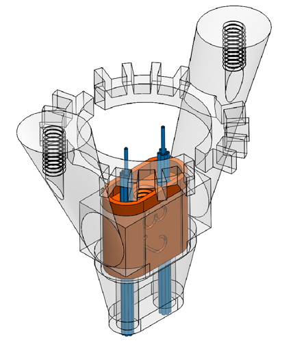
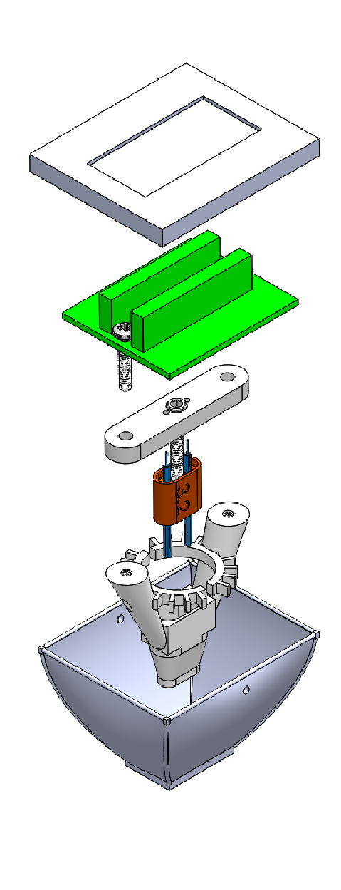

# Welcome to the HOPE project GitHub Page

Here we present and share the full design of a new brain implant.
We believe this implant will be benificial for the community as it is, open-source, cheap, easy to build, easy to modifiy via CAD software, and 3D printable.

The website is still under construction, please don't hesitate to ask what you need at sebastien.delcasso@gmail.com

 This work is licensed under a <a rel="license" href="http://creativecommons.org/licenses/by-nc-nd/4.0/">Creative Commons Attribution-NonCommercial-NoDerivatives 4.0 International License</a>.

# [Construction Protocol](https://drive.google.com/drive/u/0/folders/1y6QM0RLIuSXIH55f-533DAV3WuJ5qO4U)

**Figure 1:** Schematic Representation of HOPE implant

**Figure 2:** Exploded View of HOPE implant
